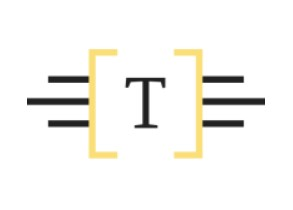

<div align="center">
    
    <h1>TG-16</h1>
    <a href="https://nodejs.org/en/"></a>
    <a href="https://www.npmjs.com/"></a>
    <a href="./LICENSE"></a>
</div>

#

TG-16 is a discord bot for fun and games.

Developer: [Bradley Myers](https://github.com/BLM16)

Date created: 2021-01-13 | Last updated: 2021-01-14

---

## Setup

**Make sure you have Node.js and npm installed.**

Install all the dependencies from a terminal with the following command. All commands are to be run from the root directory of the project unless otherwise specified:

```bat
npm install
```

Create a new app [here](https://discord.com/developers/applications). Make sure you add a bot to your application.

Copy the client id for your application and go [here](https://discordapi.com/permissions.html). Select the desired permissions (generally just administrator works), paste that client id and set the scope to bot. Copy the link it generates. That is your invite link for the bot. In [commands/invite.js](./commands/invite.js), replace the link on line 11 with that one one.

Next, copy your bot's token and paste it into a file called TOKEN in [_core](./_core). The file should have no extention and no new line after the token.

Paste the link from before into your browser to invite your bot to a server. Start the bot in a terminal with **one** of the following commands:

```bat
npm run-script run
node index.js
node .
```

## License

This code is licensed under the [MIT License](./LICENSE)
